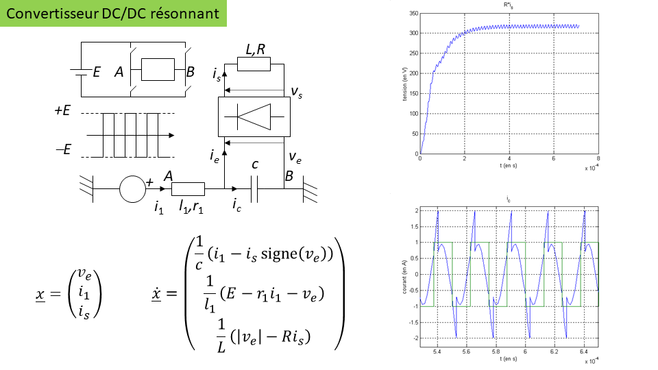

# Simulation des circuits électroniques avec commutations

## Problématique

Dans de nombreuses applications en électronique, notamment en électronique de puissance, des composants passifs (inductances, condensateurs, etc.) cohabitent dans un circuit avec d'autres composants (transistors, thyristors, diodes, etc.) qui ont des temps de commutation très petits par rapport aux constantes de temps associées aux composants passifs.

On rencontre alors des difficultés à mettre en oeuvre des méthodes de résolution numérique sur les équations d'état qui modélisent ce type de circuit. Les temps de simulation peuvent alors être très long, notamment si on utilise des méthodes à pas variable, du type [Dormand-Prince](https://en.wikipedia.org/wiki/Dormand%E2%80%93Prince_method), communément utilisées dans les environnements de calcul (Python, Matlab, etc.).

L'idée ici est d'illustrer ces difficultés sur deux exemples pour lesquels on peut exprimer directement les équations d'état. On constatera que le pas de calcul peut devenir très petit aux moments où surviennent les commutations.

## Exemples

### Oscillateur avec amplificateur opérationnel

Le schéma de cet oscillateur fait apparaître deux variables d'état $V$ et $\epsilon$ qui sont les tensions aux bornes des condensateurs. Le second est une capacité parasite sur les entrées de l'amplificateur opérationnel, donc très faible.


Le programme [test_oscillateur.py](Code/test_oscillateur.py) génère les courbes présentées ci-dessous.

```python
python test_oscillateur.py
```

Au moment des commutations, le pas de calcul diminue fortement, afin de maintenir l'erreur de consistance locale sous un certain seuil.


### Convertisseur DC/DC résonnant

Dans ce schéma, on modélisent les composants en commutation par des interrrupteurs qui commutent instantanément.



Aux instants où surviennent ces commutations instantanées, le pas de calcul descend à sa valeur minimale.


